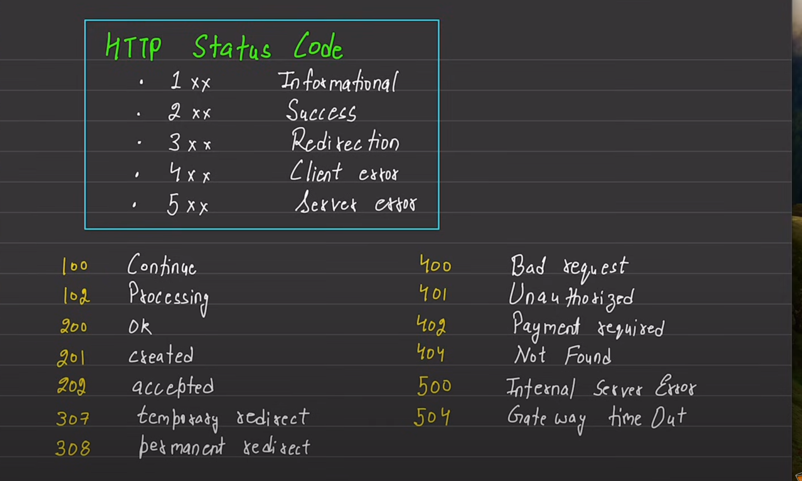

# JWT
- An access token secret is added to the environment variable, which can be generated from sha256 or written by self
- A complex string is always generated according to industry standards
- Access token expiry is also written in environment variables which refers to the time, for which the token will remain valid.
- If we write 1d, it means the token will expire after 1 day.
- More types of syntax for mentioning the time can be found in the documentation.
- Refresh token secret is also added in env var, in which as well a complex string is added similar to access token secret.
- Refresh token expiry is always set more than access token expiry
- Only refresh token is stored in database and not access token
- Access token and refresh token both are jwt tokens but are used differently
- Refresh token generation is similar to access token, but payload is given less in case of refresh token, as it keeps getting refreshed.

#
- Environment Variable m kuch change aaye to server restart karna padhta h changes dekhne k liye, nodemon use kar rhe hain tab bhi

# Strategy to upload files
- Multer k through file upload karwayenge
- Cloudinary hamse file leti hai aur apne server pe upload karwati h aws vagarah par
- Multer ka use karte hue user se file lenge aur temporarily us file ko apne local server par rakh denge
- Cloudinary ka use karte hue disc storage se file leke cloudinary k server par daal denge
- Industry standards me yahi hota hai taaki user se file leke ek baar re-upload ka chance mil sake.

# Http 
- Hyper text transfer protocol is the protocol via which text is sent over the internet.
- Http headers are metadata in the form of key-value pairs.
- http methods are set of operations used to interact with the server.
- mainly we will only use get, post, put, delete and patch
- put replaces a resource while patch changes a part of a resource
- post interacts with a resource (mostly adds a resource)
- get is used to retreive a resource.
- Sometimes http status codes are asked in interviews

# 
- endpoint ka naam "/users" na rakhke "/api/v1/users" rakhenge, industry practice hai.
- v1 matlab version 1

# Steps to register user
- Get user details from frontend
- Validation of fields ( Though validation is present in frontend, it is necessary to validate at backend as well )
- One necessary validation is not empty.
- check if user already exists ( via username or email or both )
- check for images , and avatar ( which is necessary ) uploaded on disc by multer
- upload them to cloudinary and using the returned url, check that the image is successfully uploaded on cloudinary as well.
- create user object - create entry in DB
- a response is returned on user creation , check if the user is created or not by checking if the response is null or not
- return the response to user by removing password (which would be encrypted and hence of no use) and refresh token.

#
- _id created in mongoDB is bson datatype